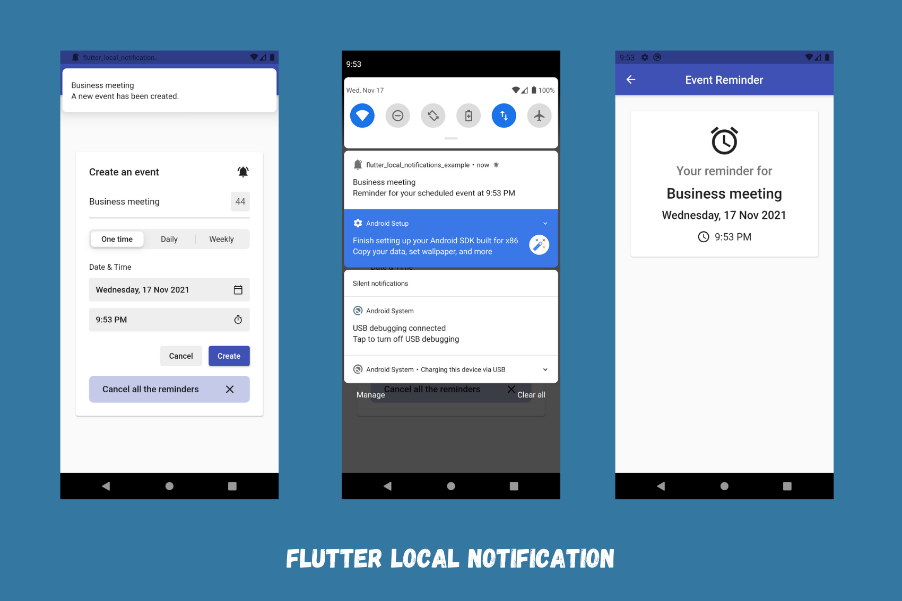

# Flutter Local Notifications Example

Flutter Local Notifications - Learn how to implement local notifications into both Android and iOS using flutter_local_notifications plugin.

This project shows - 

- how to setup platform-specific initialization settings.
- how to work with [flutter_local_noifications](https://pub.dev/packages/flutter_local_notifications) package.
- how to display a notification.
- how to schedule a notification and a recurring notification with daily or weekly interval.
- how to cancel a single notification and all pendinng notifications.

### Read the article [here on Medium](https://medium.com/@thecodexhubofficial/local-notifications-in-flutter-5e1e871a241c).

### Check the sample video [here on Instagram](https://www.instagram.com/p/CWbAXrfKLtc/?utm_source=ig_web_copy_link).

## Preview

## Getting Started

For help getting started with Flutter, view our
[online documentation](https://flutter.dev/docs), which offers tutorials,
samples, guidance on mobile development, and a full API reference.

### If you like this repository, kindly give it a star ⭐
